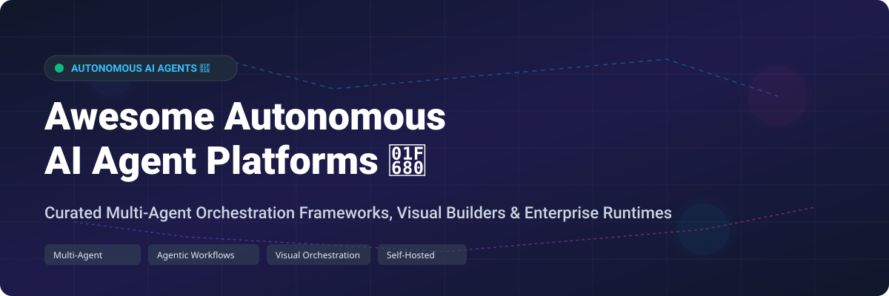

# Awesome-Autonomous-AI-Agent-Platform

# Awesome-Autonomous-AI-Agent-Platform 🤖 🚀



  





  
  
  
  
  
  



---

## 🌟 Top Autonomous AI Agent Platform Ecosystem

**Curated List of Commercial Agent Orchestration Platforms & Open-Source Multi-Agent Frameworks**  
*Focused on Agentic Workflows, Multi-Agent Collaboration, Visual Builders, Tool Integration & Self-Hosted Agent Runtimes*  

**Last updated: October 2026** 📅

---

### 📌 Overview & SEO Summary
Welcome to the ultimate curated directory of **autonomous AI agent platforms**, **multi-agent orchestration frameworks**, and **open-source agentic workflow engines**. Whether you are looking for enterprise-grade commercial solutions (such as *CrewAI Enterprise*, *LangGraph Platform*, and *Relevance AI*), or self-hostable open-source alternatives (like *AutoGen*, *CrewAI OSS*, *Laddr*, and *Dify*), this list covers category leaders, visual builders, and privacy-respecting agent deployment stacks.

---

## 📑 Table of Contents
- [🏢 SaaS & Commercial Platforms](#-saas--commercial-platforms)
- [🔓 Open-Source GitHub Projects](#-open-source-github-projects)
- [🛠️ How to Contribute](#%EF%B8%8F-how-to-contribute)
- [📊 Star History](#-star-history)
- [🤝 Support & Sponsorship](#-support--sponsorship)
- [⚠️ Disclaimer](#%EF%B8%8F-disclaimer)

---

## 🏢 SaaS / Commercial Platforms

The autonomous AI agent platform market is rapidly evolving, with pricing models shifting from per-seat to hybrid credit-based systems that bundle LLM inference and platform usage. CrewAI Enterprise starts at approximately $60,000/year with 10,000 executions and 50 deployed crews . LangGraph Platform (now LangSmith Deployment) charges $39/seat/month on the Plus tier plus usage-based deployment pricing (~$0.005 per run), with self-hosting requiring an Enterprise license under Elastic License 2.0 . Lindy AI uses per-seat pricing ranging from $30-$199.99/user/month with shared credit pools . Relevance AI offers Pro at $19/month (annual) with 2,500 actions/month, Team at $234/month with 7,000 actions . Dify Cloud provides a Sandbox free tier with 200 message credits . Flowise Cloud starts at $35/month for 10,000 predictions .

| SaaS / Commercial Platform | Company / Owner | Valuation / Market Cap | Standard Edition Starting Price | Free Tier / Free Trial Limits | Description |
| :--- | :--- | :--- | :--- | :--- | :--- |
| **[CrewAI Enterprise](https://crewai.com/pricing)** 🚀 | CrewAI | Private | $60,000/year (est. from ZenML analysis)  | Free tier available for OSS; Enterprise requires sales contact | **Enterprise multi-agent orchestration** — Studio visual editor, governance (SSO, RBAC, PII redaction), deployment on CrewAI cloud or customer VPC. 45-day onboarding included. HIPAA and SOC 2 compliant . |
| **[LangGraph Platform (LangSmith Deployment)](https://www.langchain.com/pricing)** 🕸️ | LangChain | Private | Plus: $39/seat/month + ~$0.005/run  | Self-Hosted Lite available (node-capped, requires LangSmith API key)  | **Graph-based agent deployment** — Server runtime for LangGraph agents. Managed deployment, observability, and evaluation. **Production self-hosting requires Enterprise license** (Elastic License 2.0) . |
| **[Dify Cloud](https://dify.ai/pricing)** 🎨 | Dify | Private | Professional: from ~$59/month  | **Sandbox free: 200 message credits, 1 member, 5 apps, 50 knowledge docs**  | **LLMOps platform with agentic workflows** — Visual workflow builder, RAG pipeline, agent nodes. Education version available free for annual Professional plan . |
| **[Flowise Cloud](https://flowiseai.com/)** 🎯 | FlowiseAI | Private | Starter: $35/month (10,000 predictions); Pro: $65/month  | **Free: 2 chatflows, 100 predictions/month, 5 MB storage**  | **Drag-and-drop LLM app builder** — Visual editor for chatbots and multi-agent workflows. Cloud metered by predictions; self-hosting removes ceiling . |
| **[Lindy AI](https://docs.lindy.ai/pricing)** 🧑‍💼 | Lindy | Private | Plus: $30/user/month (3,000 credits); Pro: $99.99; Max: $199.99  | **7-day free trial** with full Pro features  | **AI personal assistant for work life** — Inbox management, meeting scheduling, note-taking. Shared workspace credit pool. Enterprise adds HIPAA/BAA, SSO, audit logs . |
| **[Relevance AI](https://relevanceai.com/docs/get-started/pricing)** 📊 | Relevance AI | Private | Pro: $19/month (annual, 2,500 actions); Team: $234/month  | **Free tier: 200 actions/month, 1 project** (retired for new signups)  | **AI workforce platform** — Build agents to handle GTM workloads. 2,000+ app integrations. Enterprise adds Salesforce/Snowflake triggers, SSO, RBAC, audit logs . |
| **[Fixie.ai](https://fixee.ai/)** 💬 | Fixie.ai | Private | €260/month (START, unlimited users, 6-month commitment)  | No free tier; demo available | **Customer support agent platform** — Email, WhatsApp, WebChat channels. Semi-automated ticketing, instant translations, knowledge base. All plans include unlimited users . |
| **[AgentOps](https://agentops.ai/)** 📈 | AgentOps | Private | Custom pricing (Apify bundle: $29/1,000 results)  | Free tier available | **Agent observability and testing** — Synthetic checks, schema QA, cost anomaly detection, incident summaries, tool-firewall checks for agent workflows . |

---

## 🔓 Open-Source GitHub Projects

*Sorted by GitHub_Stars_Count (Descending)* 🌟

- **[AutoGen](https://github.com/microsoft/autogen)**   
  **Microsoft's multi-agent conversation framework**, MIT licensed. ~40k+ stars. Enables building LLM applications with multiple conversable agents. AutoGen Studio provides a **no-code GUI for prototyping multi-agent workflows** with drag-and-drop composition, interactive debugging, and a gallery of reusable components . Supports Docker environments for secure code execution. Export workflows as API endpoints or Docker containers . Not production-ready — developers encouraged to use AutoGen framework for production apps . 🏛️

- **[CrewAI](https://github.com/crewAIInc/crewAI)**   
  **Framework for orchestrating role-playing autonomous AI agents**, MIT licensed. ~20k+ stars. Agents have roles, goals, and backstories. Crews work together on complex tasks. **The OSS framework is free forever** — Enterprise adds Studio visual editor, governance, and managed deployment . 🚀

- **[Dify](https://github.com/langgenius/dify)**   
  **LLMOps platform with agentic workflows**, Apache-2.0 licensed. ~40k+ stars. Visual workflow builder combining LLM nodes, knowledge retrieval, tools, and conditional logic. **Self-hosted or Dify Cloud**. Education version free for verified students/teachers . 🎨

- **[Flowise](https://github.com/FlowiseAI/Flowise)**   
  **Drag-and-drop LLM app builder**, Apache-2.0 licensed. ~25k+ stars. Visual editor for chatbots, agents, and multi-agent workflows. **Self-host free** — Cloud metered by predictions at $35-$65/month . 🎯

- **[Laddr](https://github.com/laddr-ai/laddr)**   
  **Agent framework with explicit communication and observability**, open-source. **CrewAI alternative with Docker-native execution** . Uses **Redis Streams for explicit message passing** between containerized agents. Full observability stack: Jaeger (traces), Prometheus (metrics), and real-time dashboard. PostgreSQL with pgvector for traces. **No hidden magic** — every agent action recorded via OpenTelemetry. LLM providers: Gemini, OpenAI, Anthropic, Groq, Ollama, llama.cpp . 🔬

- **[Handcraft Agent (forge)](https://github.com/Handcraft-Agent/forge)**   
  **Production-oriented agent with 20 tools and HTTP API**, open-source. **ReAct loop** with context management, status bar, and approval workflow . Orchestrators: **parallel, debate, and supervisor** modes. Rule-first task routing (0ms for common intents). SQLite+FTS5 knowledge base, cross-session user profile, golden-set evaluation. **HTTP API server** with sessions, bearer auth, rate limiting (60/min default). Hardware protocol v1 (line-JSON, CRC) for IoT control. Docker sandbox for safe command execution . 🛠️

- **[Skein-js](https://github.com/skein-js/skein-js)**   
  **Rich chat UX for LangGraph agents**, open-source. Provides **live token streaming** and full chat interface for any LangGraph agent deployed on the server . Bridges the gap between LangGraph's powerful orchestration and production-ready user experiences. 🧵

- **[Dify Education](https://github.com/langgenius/dify)**   
  **Dify's education program**, open-source. **Free annual Professional plan** for verified students, teachers, and education workers . Requires school-issued email. Includes all Professional features except AI message credits match Sandbox (200 one-time). Must re-verify annually. 🎓

- **[AgentOps (Apify Bundle)](https://apify.com/zentrafoundry/agentops-apify-builders-bundle)**   
  **Agent observability for Apify builders**, open-source bundle. **Synthetic checks, schema QA, cost anomaly detection**, incident summaries, tool-firewall checks, and repair suggestions for Apify Actors and agent workflows . $29/1,000 results. 📊

---

## 🛠️ How to Contribute

Contributions are welcome! Follow these steps to submit new autonomous AI agent platforms or open-source agent frameworks:

1. 🍴 **Fork** the repository.
2. 📝 **Add/edit** entries in `README.md` maintaining table/list structure and formatting.
3. 🔗 Include project title, official website/GitHub link, exact Stars_Count, license, and brief description.
4. 🚀 Submit a **Pull Request** with a descriptive summary of your changes.

---

## 📊 Star History



---

## 🤝 Support & Sponsorship

If you find this autonomous AI agent platform repository useful, please consider supporting the project:

- ⭐ **Star** this repository to increase visibility!
- 🔀 **Fork** and share with fellow developers, AI engineers, and agent builders.
- ☕ **Sponsor & Buy Me a Coffee**: Support ongoing open-source curation via the [GitHub Sponsor Dashboard](https://github.com/sponsors/ishandutta2007).

---

## ⚠️ Disclaimer

- This is a **community-curated** list — not exhaustive and not an endorsement. ℹ️
- Autonomous agents execute real actions in production systems. **Review security controls, tool permissions, and approval workflows** before deploying. AutoGen Studio is explicitly a research prototype and not production-ready . LangGraph Platform self-hosting requires an Enterprise license (Elastic License 2.0), not open-source .
- Open-source agent frameworks (AutoGen, CrewAI OSS, Laddr, Handcraft Agent) provide self-hosted ownership and transparency, but enterprise-grade SLA guarantees, managed infrastructure, and 24/7 support remain primarily commercial offerings. 🤖

---



  <b>Made with ❤️ for AI engineers, agent builders, and open-source autonomous systems advocates.</b>

